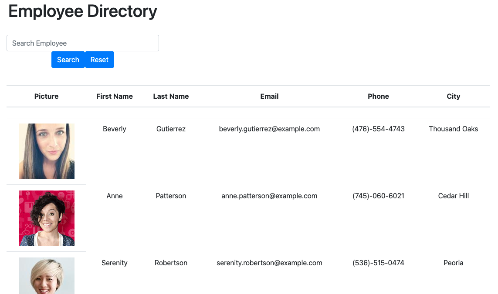

# React-Employee-Directory

*** Disclaimer: This application was rebuilt from previous apps that were deployed incorrectly.***

## Description:
This is an Employee Directory application built using React. This app allows business professionals to access necessary employee data and filter for use. Employers can search for specific employees within the search parameters, and sort employees alphabetically.

  ## Table of Contents: 

 

* [Description](#description)
* [Purpose](#purpose)
* [Technology Used](#technology-used)
* [Acceptance Criteria](#acceptance-criteria)
* [Application](#application)
* [License](#license)

 

## Purpose: 
For managers and companies on the go, this application is an easy-to-find directory for finding employees and information in a flash.

## Technology Used:
- React
- HTML5
- Bootstrap
- CSS
- Express
- Axios

## Acceptance Criteria

Given a table of random users generated from the Random User API, when the user loads the page, a table of employees renders.
The user is able to:

Sort the table by at least one category

Filter the users by at least one property.

## Application:

Link to deployed app: https://techkospeaks.github.io/react-employee-directory

## License:

‎‎ 

 
   
 
 